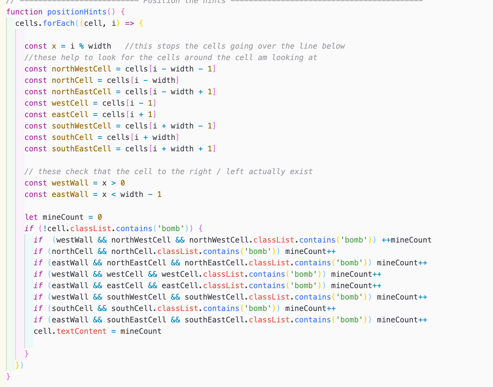
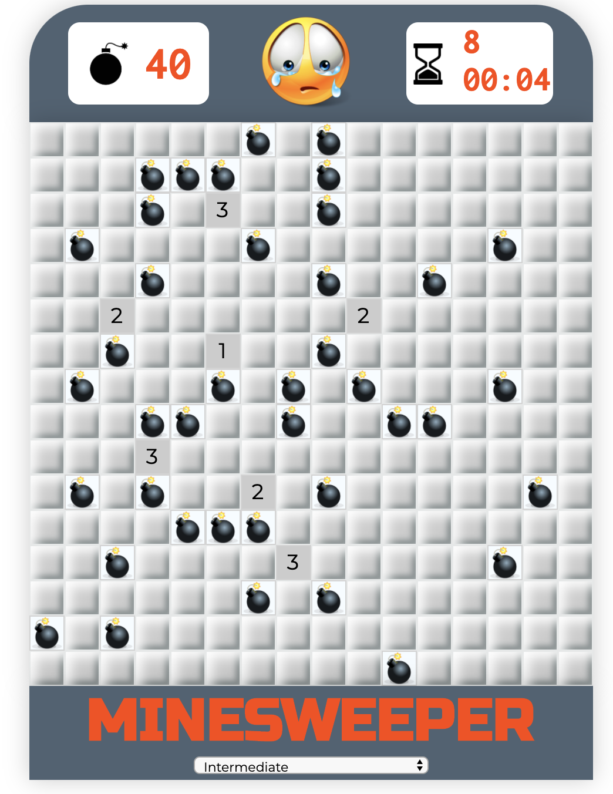
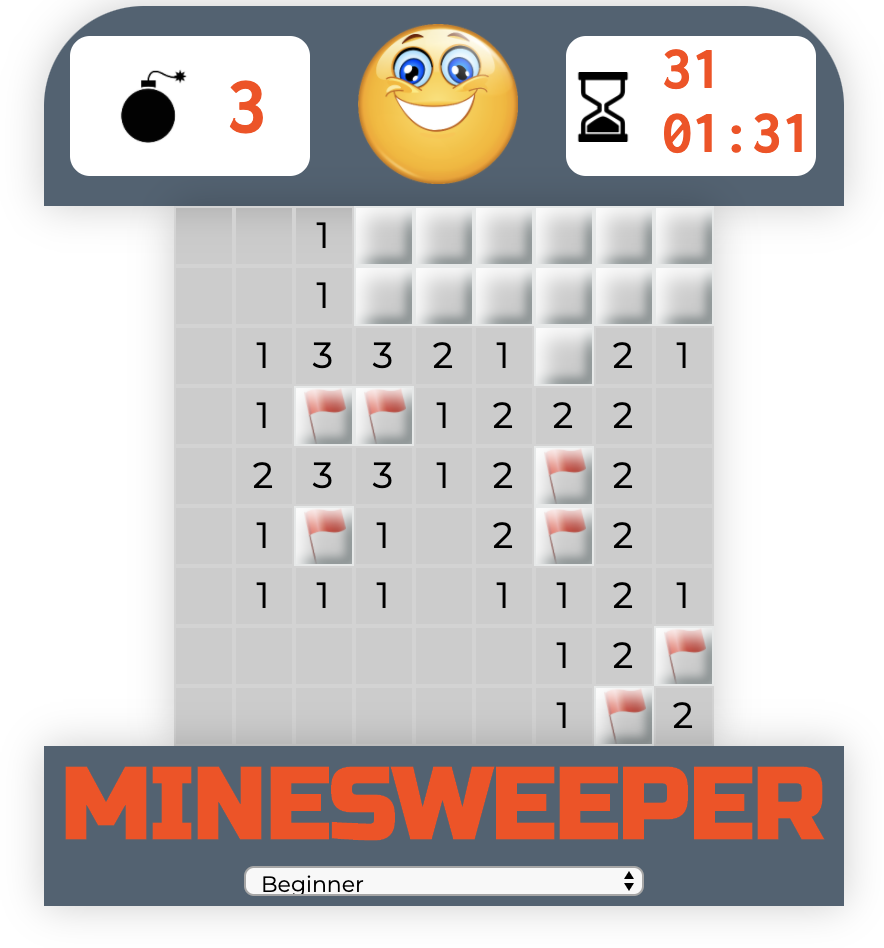
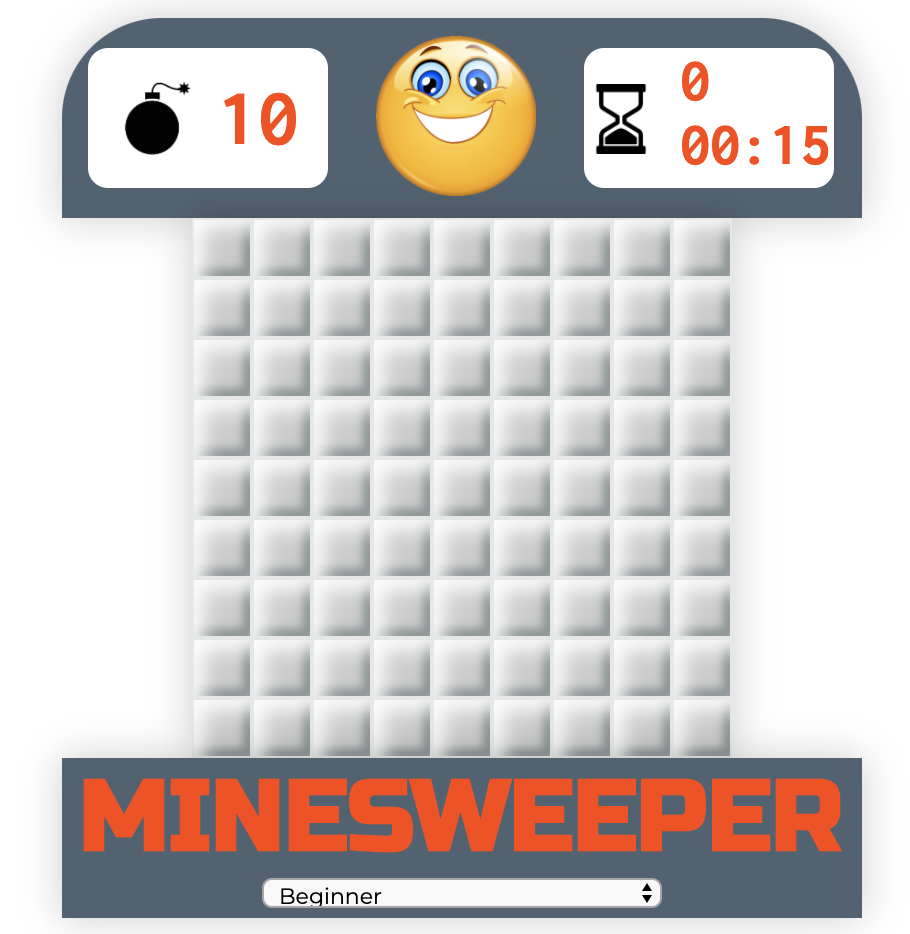
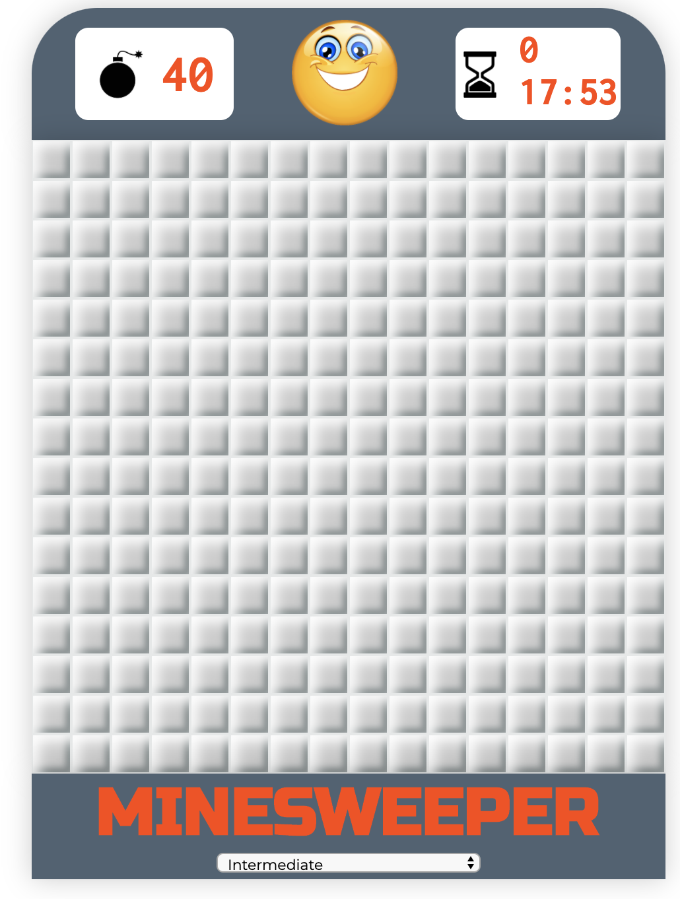
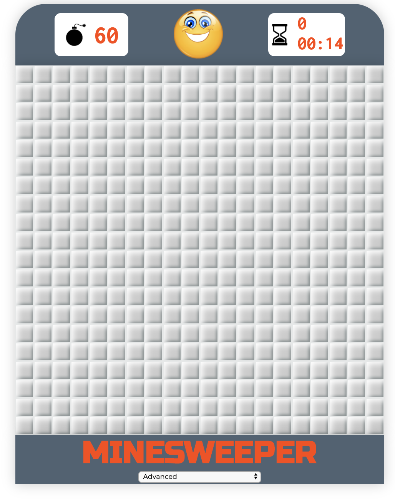
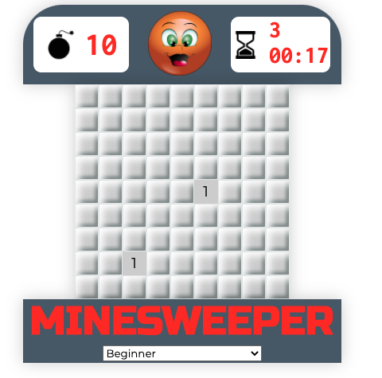
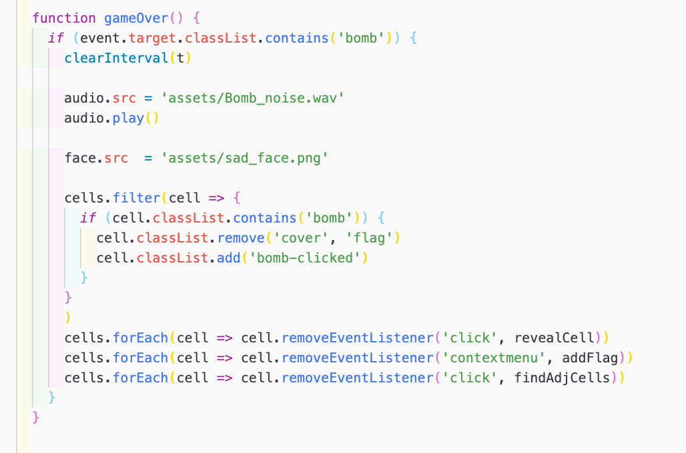
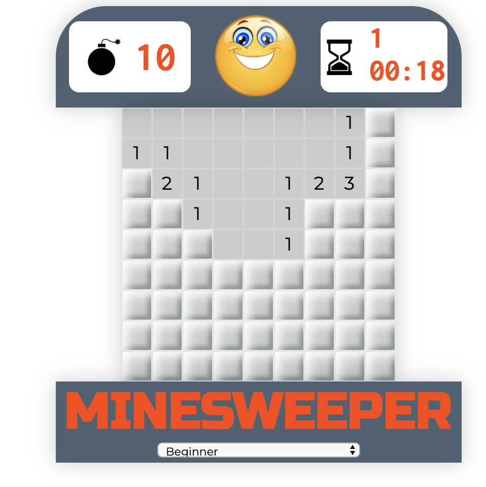
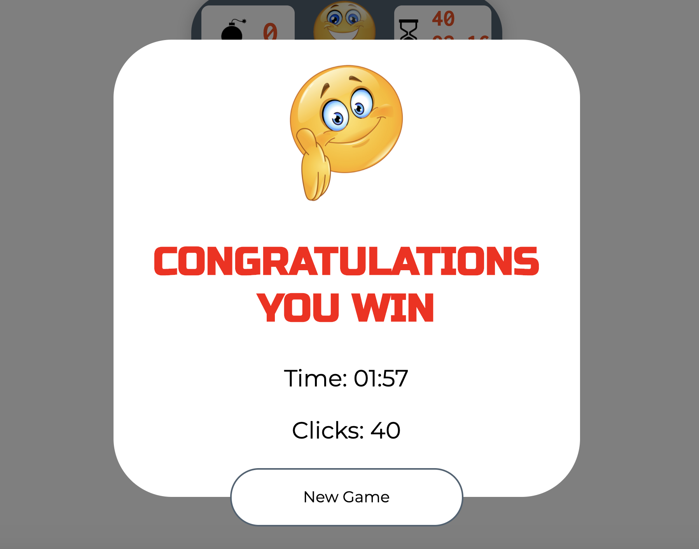

# SEI147 - PROJECT 01: A Classic Computer Game 

## Overview: Minesweeper

Minesweeper is a classic Windows PC game. The idea is to decide which tiles bombs are hidden under based on numbered clues revealed when a tile is clicked on. This was both my first project built using Javascript and the first project on the SEI course at General Aseembly, built in just over a week after three weeks on the course. 

See deployed version here: [Minesweeper](https://kamcconnell1.github.io/sei-project-one/)

-----

### Brief

* **Render a game in the browser**
* **Design logic for winning** & **visually display which player won**
* **Include separate HTML / CSS / JavaScript files**
* Stick with **KISS (Keep It Simple Stupid)** and **DRY (Don't Repeat Yourself)** principles
* Use **Javascript for **DOM manipulation**
* **Deploy your game online**, where the rest of the world can access it

-----

### Technologies Used
* HTML5 with HTML5 audio
* CSS
* JavaScript 
* GitHub
* Google Fonts

----

### Approach Taken 

#### Grid Generation
The game has been set up using a grid, constructed in Javascript, styled in CSS using an array of divs wrapped within a flexbox. I focused on building the beginner level, a 9 x 9 grid to MVP before adding additional levels.

The grid was set up as a square. On reflection, I should have set this up allowing a different height & width and specified cells by their position as x and y coordinates.

#### Featured Piece of Code 1
Bombs were placed on the field using Math.random * the number of cells. The bomb hints were placed on the grid around these using a forEach loop to get each cell in the array to look if there were bombs in any of the 8 cells surrounding them.

#### Click Events
In minesweeper if the player clicks on a tile covering a mine the game is immediately over and all the bombs are revealed. If the player manages to work out where all the bombs are located without actually clicking on them, then they win the game.

There are 4 eventualities to consider.  
1. If the player clicks on a bomb, this triggers a game over function, preventing the player clicking on any other cell in the grid & revealing where all the bombs are on the grid.

2. The player clicks on a numbered cell, this removes the cover & shows the number below. 

3. The player right clicks on the cell to place a 'flag', a marker showing where they believe a bomb to be placed. The player can toggle between placing & removing a flag should they realise it was positioned wrong.

4. The player clicks on an empty cell which then opens up the board revealing all surrounding empty cells & a ring of numbered cells. At MVP if the player clicked on an empty cell this opened up the 8 surrounding cells. A recursive formula was added to then iterate out, if any of those 8 cells had been empty to then look in the 8 cells surrounding that.

----

### Additional Levels
Two additional levels were added, intermediate (16 x 16 grid, 40 bombs) and advanced (20 x 20 grid, 60 bombs). I removed the flexbox styling the grid in CSS and styled it in JS, allowing me to specify cell size and grid size for the different levels. 

#### Beginner Level

#### Intermediate Level

#### Advanced Level

### DOM Events
The reset button at the top of a traditional Minesweeper board is a smiley emoji, which changes to a sad emoji when you lose. I added mousedown / up events to allow the emoji to change to a thinking face when you click.

#### Featured Pieve of Code 2
Audio was also added so the bombs 'go off' as they are revealed on game over.

### Wins and Blockers
The biggest problem I faced building the game is the recursive formula for opening the empty cells when the user clicks. The cells are supposed to open to reveal the empty cells up to a ring of numbered cells from the space clicked which the game does not always achieve. 

The biggest win was creating the additional levels of the game which I had not initially anticipated I would have time to do.

### Future Features

- Prevent the first cell clicked from being a bomb
- Add different colours for the numbered hints

## Game Instructions

* Once the window loads the game is ready to play & timer starts running. 
* Click any cell to start, a numbered cell means that cell is touching that number of bombs. A cell can be touching a bomb in an of the 8 surrounding cells.
* Right click to flag a cell believed to contain a bomb, flag all cells containing the bombs to win the game.
* Press the emoji at the top to reset the game.
* Choose different levels from the dropdown at the bottom.
* Good Luck!

